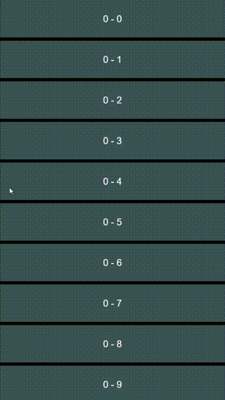
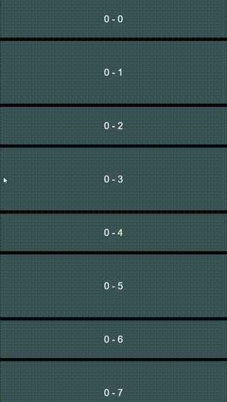
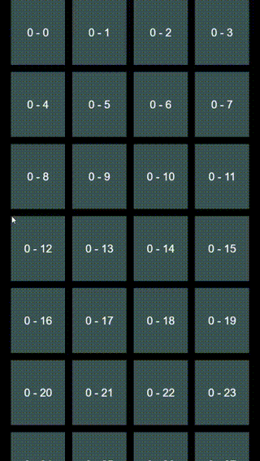
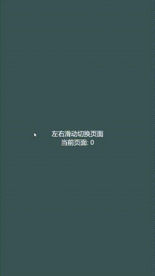
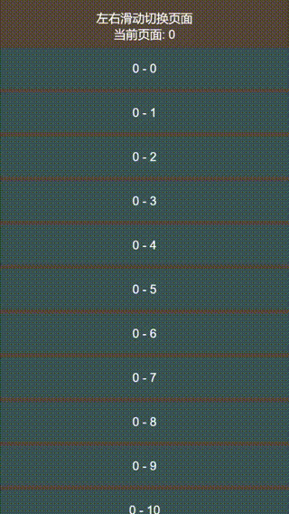
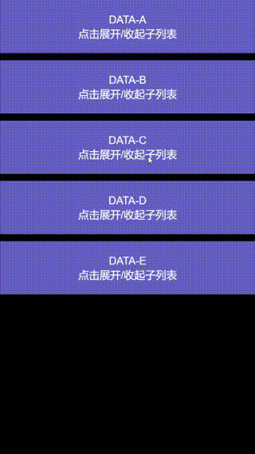
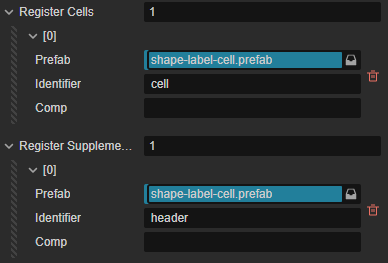

  


参考苹果 UIKit 的 UICollectionView 实现的供 Cocos Creator 使用的列表组件  

## 演示场景    

点击图片标题可跳转对应的实现场景  

| [基本列表](list-3x/assets/home/table.ts) | [基本列表 (非固定高度)](list-3x/assets/home/table_anyheight.ts) | [网格布局](list-3x/assets/home/grid.ts) |
| - | - | - |
|  |  |  |  

| [PageView](list-3x/assets/home/page_view.ts) | [PageView 嵌套](list-3x/assets/home/table_in_page.ts) | [展开子列表](list-3x/assets/home/table_sublist.ts) |
| - | - | - |
|  |  |  |  

点击图片标题可跳转对应的实现场景  

## ScrollView  

YXCollectionView 是基于 ScrollView 组件实现的，一些常规的滚动视图相关的配置可以直接通过 ScrollView 的属性/方法来修改  

```ts
// 回弹开关
listComp.scrollView.inertia = true 
// 边界开关
listComp.scrollView.elastic = true 
// 减速系数  
listComp.scrollView.brake = 0.8 
// 获取滚动状态  
let isScrolling = listComp.scrollView.isScrolling()
// 滚动  
listComp.scrollView.scrollToTop(0.5) 

// 更多 ScrollView 开放的方法 ...

```

还可以监听 ScrollView 定义的事件类型  

```ts  
// 以下两种写法一样，两个组件是同级的，获取到的是同一个 Node  
listComp.node.on(ScrollView.EventType.SCROLLING, <your func>, this)
listComp.scrollView.node.on(ScrollView.EventType.SCROLLING, <your func>, this)
```

基于 ScrollView 可以很方便的获取滚动视图的各种状态以及回调事件  

## 使用  

### 注册 cell 模板  

通过 `registerCell` 方法注册你的 cell 模板。为了支持多模板，这个方法约定了需要传一个标识符用来做区分  

举个栗子，如果你的列表内可能会显示多种不同类型的 cell，你需要创建多个 Prefab 模板，然后多次调用 `registerCell` 方法并传入不同的标识符   

```ts
listComp.registerCell(`cell1`, () => { return instantiate(<your-prefab-1>) })
listComp.registerCell(`cell2`, () => { return instantiate(<your-prefab-2>) })
listComp.registerCell(`cell3`, () => { return instantiate(<your-prefab-3>) })
...  
```

> 通过代码注册模板时接收的是 Node 对象，并非必须要求预制体 (Prefab)  

除了代码注册，也可以在编辑器里直接关联模板，注意这里的标识符也是不能重复  



### 关联数据源  

**关联数据必须至少实现两个方法**  

一个是实现 `numberOfItems` 确定一共有多少条数据  

```ts  
listComp.numberOfItems = (section) => {
    return 10000 // 一般来说这里可能会是 <yourArray>.length  
}
```

另一个是实现 `cellForItemAt` 确定要用哪个 cell 模板以及更新模板数据，这里需要通过 `dequeueReusableCell` 方法传入你注册阶段自定义的标识符来获取对应的 Node 实例对象，通过 `indexPath` 来获取当前项对应的数据  

```ts  
listComp.cellForItemAt = (indexPath, collectionView) => {
    let data = <yourArray>[indexPath.row]
    const cell = collectionView.dequeueReusableCell(`cell`)
    cell.getChildByName('label').getComponent(Label).string = `${indexPath}`
    return cell
}
```

### 确定布局排列方案  

组件本身不负责布局业务，还需要通过指定一个 `YXLayout` 子类布局对象来确定当前列表的布局方案  

以 TableView 布局为例，创建一个 YXTableLayout 对象并赋值给 `YXCollectionView.layout` 属性 

```ts  
let layout = new YXTableLayout()
layout.spacing = 10
layout.rowHeight = 120
listComp.layout = layout
```

再以网格布局为例，只需要将 YXTableLayout 替换为 GridLayout 即可  

```ts  
let layout = new GridLayout()
layout.horizontalSpacing = 20
layout.verticalSpacing = 20
layout.itemSize = new math.Size(150, 180)
listComp.layout = layout
```

### 刷新  

当以上配置都设置好后，在任何需要刷新的时候执行 `reloadData`  

```ts  
listComp.reloadData()
```

## 一些说明  

* 如果你了解 UICollectionView，需要注意两者表现并非是完全一致的 (有所欠缺)  
* 使用的话无需集成所有文件，可以把布局文件看作是插件，集成时候只需要 [核心组件文件](list-3x/assets/lib/yx-collection-view.ts) + 需要的布局文件即可  
* 目前在任何情况下 cell 节点的锚点都应该是 (0.5, 0.5)，如果发现 cell 位置不对可以检查一下锚点设置   
* cell 根节点不应该有调整自身大小的能力 - 例如不能挂载 `Widget` 组件，或者是 `CONTAINER` 模式的 `Layout` 组件  
* 监听不到 `scroll-ended` 事件，滚动时卡住(无惯性滚动，无回弹) - 将 `recycleInterval` 设置为 0  
* 异步加载图片显示错乱 - 这个问题需要自身业务层解决，因为虚拟列表节点存在复用情况，异步加载回调时机不确定  
* 列表有 Widget 组件或者列表自身节点大小改变时布局错乱 - 将 `autoReloadOnSizeChange` 设置为 true  
* 列表刷新时部分 cell 会闪烁 - 在调用 `dequeueReusableCell` 方法匹配节点时额外传一个 `indexPath` 参数  

## 相关链接  

* [Gitee 镜像](https://gitee.com/568071718/creator-collection-view)  