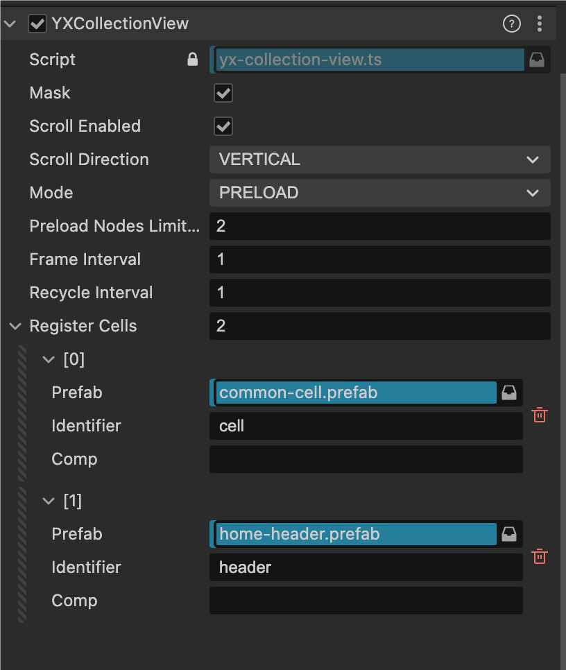

> YXCollectionView 的主要作用是管理数据的渲染和展示。为了提升性能，它通过节点池机制高效地复用单元节点，这使得它具备虚拟列表的特性。但需要特别指出的是，YXCollectionView 的核心业务不仅限于虚拟列表的管理，它更侧重于布局排列的全面控制。  
> 
> YXCollectionView 的 layout 属性决定了单元节点在屏幕上的排列方式。通过 YXLayout 作为布局管理器，YXCollectionView 将所有的布局和展示逻辑交给了 YXLayout 来处理。也就是说，YXCollectionView 本身不负责具体的布局实现，而是通过将布局职责委托给 YXLayout 来实现布局的完全解耦。这一设计的最大优势是布局的独立性：你可以针对不同的需求实现不同的布局样式，无论是 TableView、网格布局，还是其他任意排列方式，都可以通过自定义 YXLayout 来实现。每种布局都可以独立封装，不同布局之间相互隔离，互不依赖。使用时只需引入对应的布局规则，极大地提高了灵活性和可重用性。而且，由于布局规则是独立设计的，它们还可以很方便地被导出并分享给其他开发者使用。  
> 
> <small>简介由 AI 生成</small>


## 开发环境
* 2.x  
    引擎版本：Cocos Creator **2.4.13**  
    编程语言：TypeScript
* 3.x  
    引擎版本：Cocos Creator **3.8.0**  
    编程语言：TypeScript  

## 基本特性  

* 节点回收复用(虚拟列表模式)  
* 分帧预加载节点(非虚拟列表模式)  
* 多种单元 cell 节点类型  
* 列表嵌套  
* 分区概念  
* [布局解耦]()  

## 使用  

注册 cell，通过 register() 注册列表内可能用到的节点类型，可多次注册    

```ts
this.listComp.register(`cell1`, () => instantiate(<your cell prefab>))
this.listComp.register(`cell2`, () => instantiate(<your cell prefab>))
this.listComp.register(`cell3`, () => instantiate(<your cell prefab>))
this.listComp.register(`cell4`, () => instantiate(<your cell prefab>))
this.listComp.register(`cell5`, () => instantiate(<your cell prefab>))
```

---  

绑定数据源，更新节点数据   

```ts
// this.testData 是模拟数据  

// 确定列表内一共需要显示多少条内容   
this.listComp.numberOfItems = () => this.testData.length;

this.listComp.cellForItemAt = (indexPath, collectionView) => {
    // 通过下标可以获取到对应的数据
    const data = this.testData[indexPath.item]

    // 通过标识符获取重用池内的节点
    const cell = collectionView.dequeueReusableCell(`your cell identifier`)

    // 更新数据显示
    const comp = cell.getComponent(CommonCell)
    comp.label.string = `${indexPath}`
    comp.randomIcon()
    comp.randomShapeColor()
    comp.randomStar()
    comp.randomLevelSign()

    return cell // 返回这个节点给列表显示
}
```

---   

确定布局方案  

```ts
let layout = new YXTableLayout()
layout.spacing = 20
layout.itemSize = new math.Size(400, 100)
this.listComp.layout = layout
```

---  

以上几个步骤不分先后，确保都配置好就好，数据源绑定/布局对象配置好之后，在需要刷新的时候执行 reloadData  

```ts
// 更新列表
this.listComp.reloadData()
```  

---  

补充: 附张通过编辑器内注册 cell 的截图  




